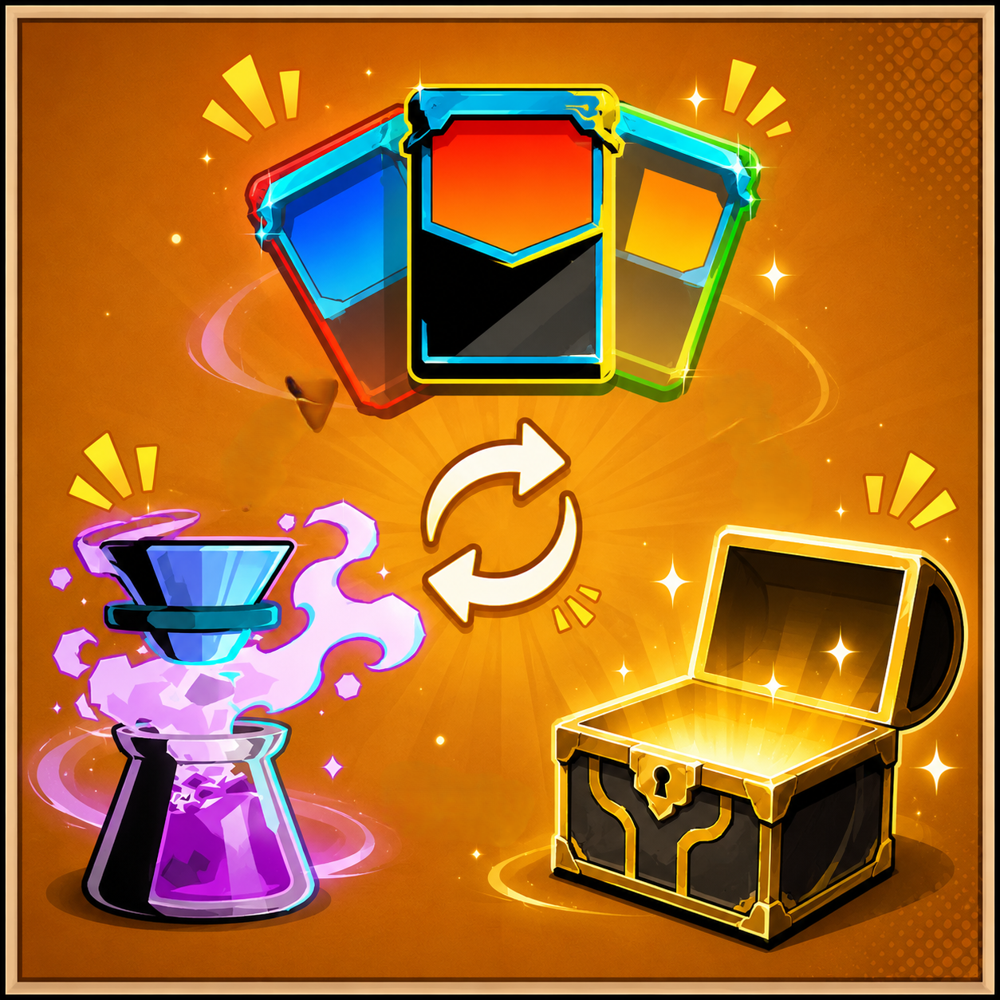

  

# 
Switch the Spire

  <b>自由调整游戏中的奖励类型</b> 
  卡牌可以换成遗物/药水,药水可以换成卡牌…… 
  (商店直购不受影响)

## 功能

- **自由转换**：卡牌 → 遗物 / 药水，遗物 → 卡牌 / 药水，药水 → 卡牌 / 遗物
- **按 <kbd>F7</kbd> 设置**：游戏中按下 F7 弹出窗口，选择你想要的替换方式，保存后立刻生效。

## 使用

1. 游戏中按 **F7** 打开“奖励转换设置”。
2. 你会看到三个下拉菜单：
   - **卡牌奖励 → 换成：** [卡牌 / 遗物 / 药水]
   - **遗物奖励 → 换成：** [卡牌 / 遗物 / 药水]
   - **药水奖励 → 换成：** [卡牌 / 遗物 / 药水]
3. 选好后点击“保存设置”，游戏中的所有对应奖励就会自动替换为你指定的类型。

> **手动配置**：你也可以直接编辑模组目录下的 `config.json` 文件来修改。

## TODO（计划中）

- [ ] 支持多人模式
- [ ] 替换事件中的奖励文本
- [ ] 让玩家选择哪些事件受模组影响
- [ ] 随机转换模式（每次随机换成另一种奖励）